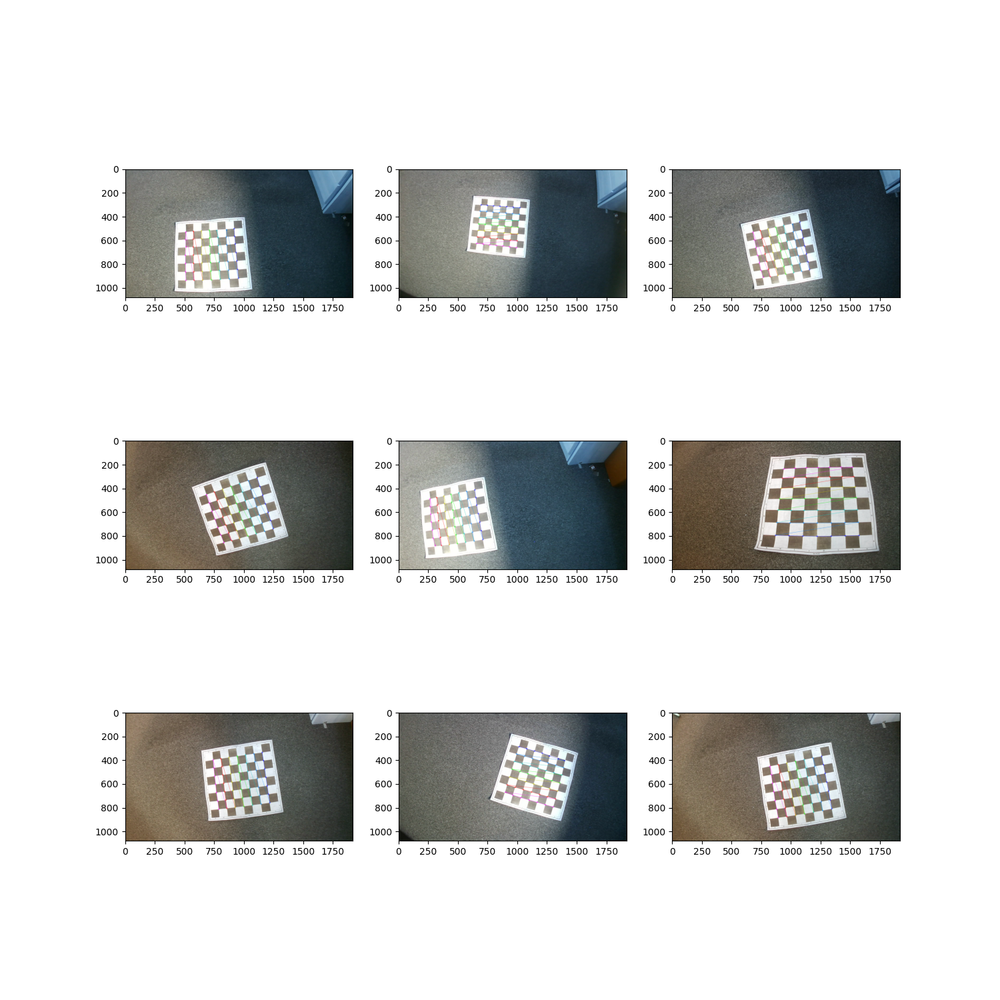
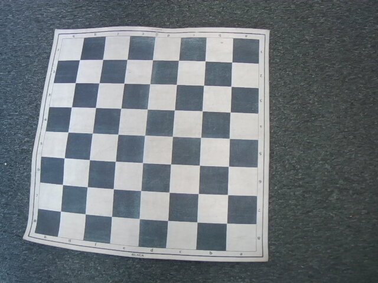

<p align="center"><b><ins> Camera Calibration </ins></b></p>

---

<br>

<b> Usage: </b>
<br><br>

<b> Get the calibration parameters: </b>
<br>```python calibrate.py --path images/low_resolution --res low --vis --save-params --save-vis```



<br>

<b> Undistort images: </b>
<br>```python inference.py --path high_res_test.jpg --vis --save```

 

<br>

---

<br>

- We already have a [Linear camera model](./Linear%20Camera%20Model.md), which is given by the projection matrix.
- We now move on to calibrating the camera, which essentially means estimating the projection matrix.
- This is done by using an object of known geometry (checkerboard pattern).
- In this case, a regular chessboard was used.



- Next, the correspondances between the 3D scene points and image points are identified.
- For each of the corresponding point $i$ in the scene and image:

$$
\begin{bmatrix}
    u^{(i)}\\
    v^{(i)}\\
    1
\end{bmatrix}
\equiv
\begin{bmatrix}
    p_{11} & p_{12} & p_{13} & p_{14}\\
    p_{21} & p_{22} & p_{23} & p_{24}\\
    p_{31} & p_{32} & p_{33} & p_{34}
\end{bmatrix}
\begin{bmatrix}
    x_{w}^{(i)}\\
    y_{w}^{(i)}\\
    z_{w}^{(i)}\\
    1
\end{bmatrix}
$$

- We are interested in finding the (3x4) Projection Matrix $P$.
- Expanding the matrix as linear equations:

$$
u^{(i)} = \frac{p_{11}x_{w}^{(i)} + p_{12}y_{w}^{(i)} + p_{13}z_{w}^{(i)} + p_{14}}{p_{31}x_{w}^{(i)} + p_{32}y_{w}^{(i)} + p_{33}z_{w}^{(i)} + p_{34}}
$$

$$
v^{(i)} = \frac{p_{21}x_{w}^{(i)} + p_{22}y_{w}^{(i)} + p_{23}z_{w}^{(i)} + p_{24}}{p_{31}x_{w}^{(i)} + p_{32}y_{w}^{(i)} + p_{33}z_{w}^{(i)} + p_{34}}
$$

<br><br>

---

<br>

<ins><b> Least Squares Solution for Projection Matrix $P$ </b></ins>

1. Set scale so that $p_{34} = 1$

2. Set $Ap$ as close to 0 as possible and $\begin{Vmatrix}p\end{Vmatrix}^{2} = 1$: <br>
    - $min_{p} \begin{Vmatrix}Ap\end{Vmatrix}^{2}$ such that $\begin{Vmatrix}p\end{Vmatrix}^{2} = 1$
    - $min_{p} \begin{Vmatrix}p^{T}A^{T}Ap\end{Vmatrix}^{2}$ such that $\begin{Vmatrix}p^{T}p\end{Vmatrix}^{2} = 1$

3. Define the Loss function $L(p, \lambda)$: <br>
    - $L(p, \lambda) = p^{T}A^{T}Ap - \lambda(p^{T}p - 1)$

<br>

4. Taking the derivatives of $L(p, \lambda)$ w.r.t. p:
    - $\boxed{2A^{T}Ap - 2\lambda p = 0}$

<br>

- Finding the $P$ that minimizes L is equivalent to solving the eigenvalue problem:

    $$
    \boxed{A^{p}Ap = \lambda p}
    $$

- Eigenvector $p$ with the smallest eigenvalue $\lambda$ of matrix $A^{T}A$ minimizes the loss function $L(p)$.
