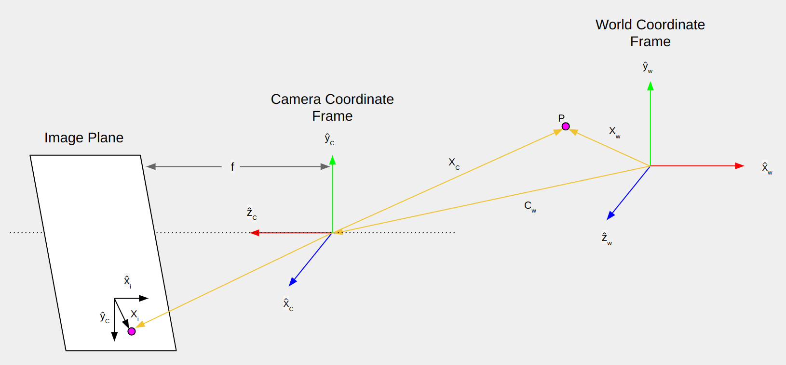

<b><ins> Linear Camera Model </ins></b>

- The first step is to develop a camera model in order to calibrate the camera.

  

---

 

<ins><b> Forward Imaging Model: 3D to 2D </b></ins>

 Figure 1: Forward imaging model. Credits: Shree Nayar (First Principles of Computer Vision)

- The world coordinate frame is denoted by $w$ $(\hat{x}_{w}, \hat{y}_{w}, \hat{z}_{w})$.
- Consider a single point $P$ in the world coordinate frame.
- The camera also lies in the world coordinate frame, but it is also defined by its own coordinate frame $c$ $(\hat{x}_{c}, \hat{y}_{c}, \hat{z}_{c})$, where the z-axis of the camera coordinate frame is aligned with the optical axis of the camera.
- The distance between thee effective central projection and the image plane is $f$.

 

- If we know the relative orientation and the position of the camera coordinate frame with respect to the world coordinate frame, then we can project the point P in the world coordinate frame onto the image plane.

 

This entire mapping process from point $P$ to point $x$ is called the forward imaging model.

- In a nutshell:

$$x_{w} = 
\begin{bmatrix}
    \hat{x_{w}}\\
    \hat{y_{w}}\\
    \hat{z_{w}}
\end{bmatrix}
⟶
x_{c} = 
\begin{bmatrix}
    \hat{x_{c}}\\
    \hat{y_{c}}\\
    \hat{z_{c}}
\end{bmatrix}
⟶
x_{i} = 
\begin{bmatrix}
    \hat{x_{i}}\\
    \hat{y_{i}}
\end{bmatrix}
$$

$$World\ Coordinates ⟶ Camera\ Coordinates ⟶ Image\ Coordinates$$

 

- The transformation of world coordinates to camera coordinates is called <ins>Coordinate Transformation</ins>.
- This is a 3D to 3D transformation.

 

- The transformation of camera coordinates to image coordinates is called <ins>Perspective Projection</ins>.
- This is a 3D to 2D transformation.

  

---

 

<ins><b> Perspective Projection </ins></b>

- Assuming that the point is defined in the camera coordinate frame, the perspective projection equations are given by:

$$
\frac{x_{i}}{f}=\frac{x_{c}}{z_{c}}\ and\ \frac{y_{i}}{f}=\frac{y_{c}}{z_{c}}
$$

- This can be rewritten as:
  
$$
x_{i} = f \frac{x_{c}}{z_{c}}\ and\ y_{i} = f \frac{y_{c}}{z_{c}}
$$

- xi and yi are the coordinates of the projection of the point P onto the image plane.

 

- While mapping the image coordinates (milimeters) to pixel coordinates (pixels), we have to keep in mind that the pixels themselves might be rectangular.
- Thus, if mx and my are pixel densities (pixels / mm) in the x and y directions respectively, then the pixel coordinates are given by:

$$ 
u = m_{x}x_{i} = m_{x}f\frac{x_{c}}{z_{c}} + o_{x} 
$$

$$ 
v = m_{y}y_{i} = m_{y}f\frac{y_{c}}{z_{c}} + o_{y} 
$$

- The addition of ox and oy is done because the coordinate frame of the image is usually located at one of the four corners of the image, but the Principle Point is located at the centre of the image.

- Since the pixel density mx and the focal length f are both unknown to us, we, can combine these into a single parameter, and rewrite the equation as:

$$ 
u = f_{x} \frac{x_{c}}{z_{c}} + o_{x} 
$$

$$ 
v = f_{y} \frac{y_{c}}{z_{c}} + o_{y} 
$$

- Here, (fx, fy) = (mxf, myf) are the focal lengths in pixels in the x and y directions.

- Hence, we are left with 4 unknown parameters, fx, fy, ox and oy.

- These parameters are called the <ins>intrinsic parameters</ins> and they represent the internal geometry of the camera.

 

- These equations for perspective projection are non-linear.
- It is convenient to express them as linear equations. In this caase, homogeneous equations are used to go from a non-linear model to a linear model.

  

<ins><b>Homogeneous Coordinates</b></ins>

- The homogeneous representation of a 2D point <b>u</b> = $(u, v)$ is a 3D point $\tilde{u} = (\tilde{u}, \tilde{v}, \tilde{w})$.
- The third coordinate $\tilde{w} \neq 0$ is ficticious such that:

$$
u = \frac{\tilde{u}}{\tilde{w}} \ \ \ \ \ \ v = \frac{\tilde{v}}{\tilde{w}}
$$

$$
\therefore u \equiv 
\begin{bmatrix}
    u\\
    v\\
    1
\end{bmatrix} 
\equiv
\begin{bmatrix}
    \tilde{w}u\\
    \tilde{w}v\\
    \tilde{w}
\end{bmatrix}
\equiv
\begin{bmatrix}
    \tilde{u}\\
    \tilde{v}\\
    \tilde{w}
\end{bmatrix} = 
\tilde{u}
$$

 

- The homogeneous representation of a 3D point $x = (x, y, z)$ is a 4D point $\tilde{x} = (\tilde{x}, \tilde{y}, \tilde{z}, \tilde{w})$.
- Here, the fourth coordinate $\tilde{w} \neq 0$ is ficticious such that:

$$
x = \frac{\tilde{x}}{\tilde{w}} \ \ \ \ \ \ y = \frac{\tilde{y}}{\tilde{w}} \ \ \ \ \ \ z = \frac{\tilde{z}}{\tilde{w}}
$$

$$
\therefore x \equiv 
\begin{bmatrix}
    x\\
    y\\
    z\\
    1
\end{bmatrix} 
\equiv
\begin{bmatrix}
    \tilde{w}x\\
    \tilde{w}y\\
    \tilde{w}z\\
    \tilde{w}
\end{bmatrix}
\equiv
\begin{bmatrix}
    \tilde{x}\\
    \tilde{y}\\
    \tilde{z}\\
    \tilde{w}
\end{bmatrix} = 
\tilde{x}
$$

 

- Thus, the homogeneous coordinates of $(u, v)$ are:
  
$$
\begin{bmatrix}
    u\\
    v\\
    1
\end{bmatrix}
\equiv
\begin{bmatrix}
    \tilde{u}\\
    \tilde{v}\\
    \tilde{w}
\end{bmatrix}
\equiv
\begin{bmatrix}
    z_{c}u\\
    z_{c}v\\
    z_{c}
\end{bmatrix} = 
\begin{bmatrix}
    f_{x}x_{c} + z_{c}o_{x}\\
    f_{y}y_{c} + z_{c}o_{y}\\
    z_{c}
\end{bmatrix} = 
\boxed{
\begin{bmatrix}
    f_{x} & 0 & o_{x} & 0\\
    0 & f_{y} & o_{y} & 0\\
    0 & 0 & 1 & 0\\
\end{bmatrix}
\begin{bmatrix}
    x_{c}\\
    y_{c}\\
    z_{c}\\
    1
\end{bmatrix}
}
$$

- where: $(u, v) = (\frac{\tilde{u}}{\tilde{w}}$, $\frac{\tilde{v}}{\tilde{w}})$

 

- Thus we end up with a 3x4 matrix that includes all the internal parameters of the camera $f_{x},\ f_{y},\ o_{x}\ and\ o_{y}$ multiplied by the homogeneous coordinates of the 3D point defined in the camera coordinate frame $x_{c},\ y_{c},\ and\ z_{c}$.
- This 3x4 matrix is called the intrinsic matrix.

 

- This 3x3 block is called the calibration matrix, is an upper right triangular matrix, which is used to calculate various parameters.

$$
\boxed{
K = 
\begin{bmatrix}
    f_{x} & 0 & o_{x}\\
    0 & f_{y} & o_{y}\\
    0 & 0 & 1
\end{bmatrix}
}
$$

 

- <ins>Thus, we have Mint that takes us from a homogeneous representation of a point in the camera coordinate frame (3D) to its pixel coordinates in the image (2D)</ins>.

$$
\tilde{u} = [K|0] \tilde{x_{c}} = M_{int} \tilde{x_{c}}
$$

  

---

 

<ins><b>Coordinate Transformation</b></ins>

- The mapping of a point from the world coordinates to the camera coordinates (3D to 3D) can be done using the position and orientation of the camera in the world coordinate frame $W$.
- The position $c_{w}$ and orientation $R$ of the camera in the world coordinate frame $W$ are the camera's <ins>extrinsic parameters</ins>
- The rotation matrix $R$ is given by:

$$
R = \begin{bmatrix}
    r_{11} & r_{12} & r_{13}\\
    r_{21} & r_{22} & r_{23}\\
    r_{31} & r_{32} & r_{33}
\end{bmatrix}
$$

- The first, second and third rows correspond to the direction of $\tilde{x_{c}}$, $\tilde{y_{c}}$ and $\tilde{z_{c}}$ respectively, in the world coordinate frame.
- The rottion matrix is Orthonormal.

 

- Given the extrinsic parameters $(R, c_{w})$ of the camera, the camera-centric location of the point P in the corld coordinate frame is:

$$
x_{c} = R(x_{w} - c_{w}) = Rx_{w} - Rc_{w} = Rx_{w} + t
\\
t = -Rc_{w}
$$

 

$$
x_{c} = 
\begin{bmatrix}
    x_{c}\\
    y_{c}\\
    z_{c}
\end{bmatrix} =
\begin{bmatrix}
    r_{11} & r_{12} & r_{13}\\
    r_{21} & r_{22} & r_{23}\\
    r_{31} & r_{32} & r_{33}
\end{bmatrix}
\begin{bmatrix}
    x_{w}\\
    y_{w}\\
    z_{w}
\end{bmatrix} +
\begin{bmatrix}
    t_{x}\\
    t_{y}\\
    t_{z}
\end{bmatrix}
$$

 

- Thus, we haave mapped a point P from the world coordinate frame to the camera coordinate frame.
- Rewriting using homogeneous coordinates:

$$
\boxed{
\tilde{x_{c}} = 
\begin{bmatrix}
    x_{c}\\
    y_{c}\\
    z_{c}\\
    1
\end{bmatrix} =
\begin{bmatrix}
    r_{11} & r_{12} & r_{13} & t_{x}\\
    r_{21} & r_{22} & r_{23} & t_{y}\\
    r_{31} & r_{32} & r_{33} & t_{z}\\
    0 & 0 & 0 & 1
\end{bmatrix}
\begin{bmatrix}
    x_{w}\\
    y_{w}\\
    z_{w}\\
    1
\end{bmatrix}
}
$$

 

Thus, the extrinsic matrix is given by:

$$
M_{ext} = 
\begin{bmatrix}
    R_{3x3} & t\\
    0_{1x3} & 1
\end{bmatrix} = 
\begin{bmatrix}
    r_{11} & r_{12} & r_{13} & t_{x}\\
    r_{21} & r_{22} & r_{23} & t_{y}\\
    r_{31} & r_{32} & r_{33} & t_{z}\\
    0 & 0 & 0 & 1
\end{bmatrix}
$$

$$
\tilde{x_{c}} = M_{ext}\tilde{x_{w}}
$$

  

---

 

- Finally, we will look at the mapping from the world coordinate frame to pixels in the image.
- We know that the mapping from the world coordinate frame to camera coordinate frame $(\tilde{x_{w}} ⟶ \tilde{x_{c}})$, the extrinsic matrix, is given by:

$$
\begin{bmatrix}
    x_{c}\\
    y_{c}\\
    z_{c}\\
    1
\end{bmatrix} =
\begin{bmatrix}
    r_{11} & r_{12} & r_{13} & t_{x}\\
    r_{21} & r_{22} & r_{23} & t_{y}\\
    r_{31} & r_{32} & r_{33} & t_{z}\\
    0 & 0 & 0 & 1
\end{bmatrix}
\begin{bmatrix}
    x_{w}\\
    y_{w}\\
    z_{w}\\
    1
\end{bmatrix}
$$

$$
\tilde{x_{c}} = M_{ext}\tilde{x_{w}}
$$

- We also know that the mapping from the camera coordinate frame to pixels in the image, the intrinsic matrix, is given by:

$$
\begin{bmatrix}
    \tilde{u}\\
    \tilde{v}\\
    \tilde{w}
\end{bmatrix} = 
\begin{bmatrix}
    f_{x} & 0 & o_{x} & 0\\
    0 & f_{y} & o_{y} & 0\\
    0 & 0 & 1 & 0\\
\end{bmatrix}
\begin{bmatrix}
    x_{c}\\
    y_{c}\\
    z_{c}\\
    1
\end{bmatrix}
$$

$$
\tilde{u} = M_{int}\tilde{x_{c}}
$$

 

- Thus, we can combine the two to get a direct mapping from a point in the world coordinate frame to pixels in the image.

$$
\boxed{
\tilde{u} = M_{int}M_{ext}\tilde{x_{w}} = P\tilde{x_{w}}
}
$$

- Here, $P$, which is the product of the intrinsic and extrinsic matrices, is called the <ins>Projection matrix</ins>.

$$
\boxed{
\begin{bmatrix}
    \tilde{u}\\
    \tilde{v}\\
    \tilde{w}
\end{bmatrix} = 
\begin{bmatrix}
    p_{11} & p_{12} & p_{13} & p_{14}\\
    p_{21} & p_{22} & p_{23} & p_{24}\\
    p_{31} & p_{32} & p_{33} & p_{34}
\end{bmatrix}
\begin{bmatrix}
    x_{w}\\
    y_{w}\\
    z_{w}\\
    1
\end{bmatrix}
}
$$