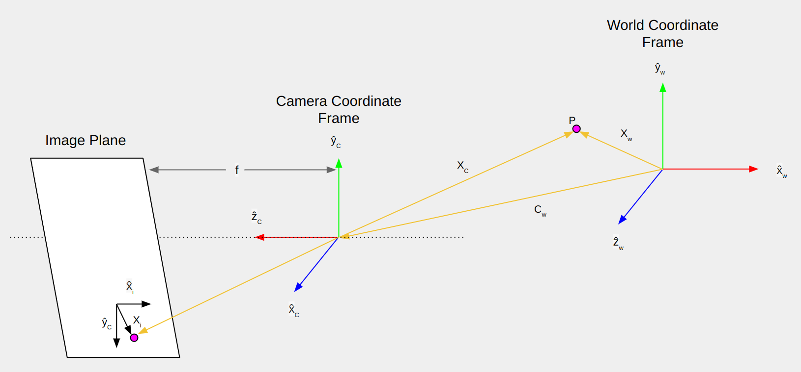

<b><ins> Camera Calibration and 3D Reconstruction </ins></b>

- One of the key problems in Computer Vision is recovering the 3D structure of a scene from its images.
- The only information available is a set of images, where the points are measured in pixels.
- We have a scene defined in some world coordinate frame, and when we have reconstructed the scene, we would effectively like to know where each point lies in the world coordinate frame, say, in millimeters.

 

- Two things are needed in order to go from images to a metric reconstruction:

    - External/Extrinsic Parameters :- The position and orientation of the camera with respect to the world coordinate frame.
    - Internal/Intrinsic Parameters :- How the camera maps (via perspective projection) points in the world onto its image plane (e.g. focal length)

- Determining the external and internal parameters of the camera is called camera calibration.

  

---

 

[1. Linear Camera Model](./Notes/Linear%20Camera%20Model.md)

[2. Camera Calibration](./Notes/Camera%20Calibration.md)

[3. Extracting Intrinsic and Extrinsic Matrices](./Notes/Extracting%20Intrinsic%20and%20Extrinsic%20Matrices.md)

[4. Simple Stereo](./Notes/Simple%20Stereo.md)

   

---

 

<ins><b> [Forward Camera Model](./Notes/Linear%20Camera%20Model.md) </ins></b>

 

---

 

<ins><b> [Camera Calibration](./Camera_Calibration/) </b></ins>

   

---

 

<ins><b> [Camera Pose Estimation](./Camera_Pose_Estimation/README.md) </b></ins>

 

References:

- [First Principles of Computer Vision: Camera Calibration](https://www.youtube.com/playlist?list=PL2zRqk16wsdoCCLpou-dGo7QQNks1Ppzo)
- [OpenCV Tutorials](https://opencv24-python-tutorials.readthedocs.io/en/latest/py_tutorials/py_tutorials.html)
